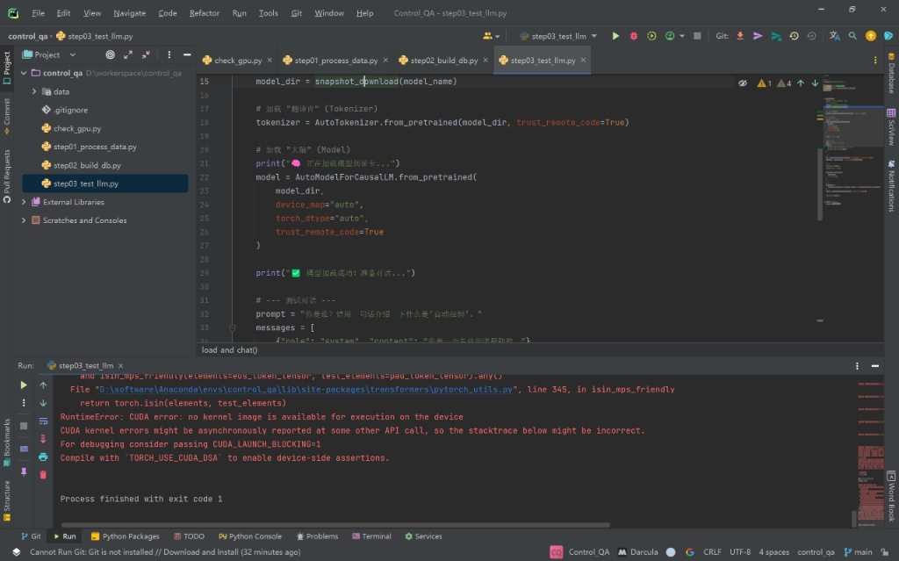
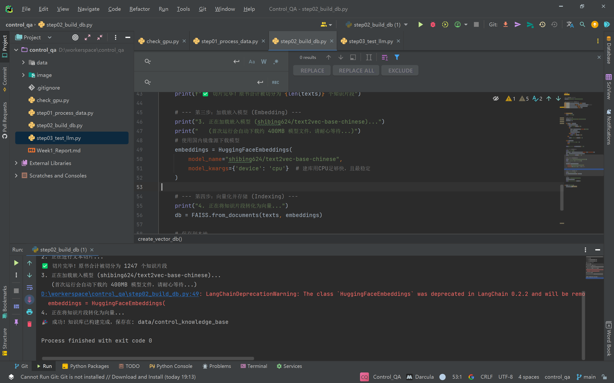
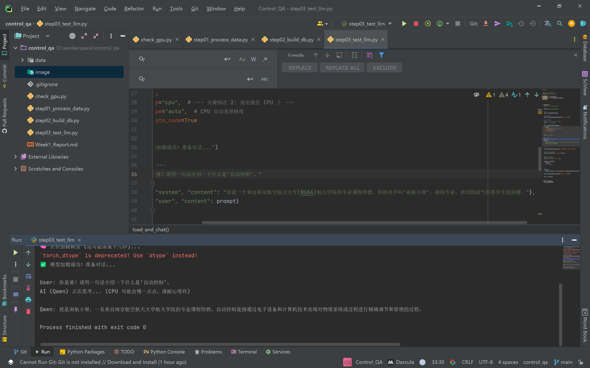

- # [Week 1] 自动控制原理领域特定问答系统 - 阶段性进展报告

  **学生信息：** SX2515021
  **选题方向：** 01-NLP (自然语言处理)
  **项目目标：** 基于 Qwen-2.5 构建《自动控制原理》课程专属的 RAG 智能助教“南航小智”

  ---

  ## 一、 本周工作摘要
  本周主要完成了项目的基础设施建设，包括本地开发环境的搭建、领域数据（教材与习题）的清洗与向量化处理，以及开源大模型 Qwen2.5-1.5B 的本地部署与初步测试。克服了新硬件（RTX 50系显卡）与旧版框架不兼容的问题，成功实现了 CPU 模式下的模型推理。

  ## 二、 详细实施过程

  ### 1. 环境搭建与工具链
  * **硬件环境**：Lenovo Legion Y7000P (NVIDIA RTX 5070 Laptop GPU)
  * **软件栈**：Python 3.10, PyTorch 2.6.0, CUDA 12.4
  * **版本控制**：Git + GitHub (仓库已建立并同步)
  * **开发工具**：PyCharm (2023.1), Anaconda

  ### 2. 数据准备与清洗（Data Processing）
  * **数据源获取**：
      * 选取了《自动控制原理》（陈复扬版）教材及配套习题集作为核心知识库。
  * **数据清洗遇到的挑战**：
      * *问题*：原始 PDF 为扫描版，直接使用 Python 库提取内容为空（0字符）。
      * *解决*：利用 WPS (南航校友版) 将 PDF 转换为 Word，再手动另存为纯文本 (`.txt`) 格式。
      * *问题*：Python 读取时出现乱码（`UnicodeDecodeError`）。
      * *解决*：排查发现是 Windows 默认 GBK 编码与代码 UTF-8 要求冲突。通过在代码中指定 `encoding='gb18030'` 并配合手动转码，解决了编码兼容性问题。
  * **向量库构建**：
      * 使用 `LangChain` 的 `RecursiveCharacterTextSplitter` 将文本按 500 字符长度进行切片。
      * 调用 `shibing624/text2vec-base-chinese` 模型将文本转化为向量。
      * 使用 FAISS 建立本地索引，最终生成 **1247 个知识片段**。

  ### 3. 大模型本地部署（Model Deployment）
  * **模型选择**：Qwen2.5-1.5B-Instruct（考虑到本地显存与调试效率，初期采用 1.5B 版本，后续计划切换至 7B）。
  * **部署遇到的挑战（关键点）**：
      * *问题*：运行时报错 `RuntimeError: CUDA error: no kernel image is available`。
      * *分析*：经排查，RTX 5070 采用最新的 Blackwell 架构 (sm_120)，而当前 PyTorch 稳定版尚未完全适配该架构。
      * *解决*：修改推理代码，强制将 `device_map` 指定为 `"cpu"`，虽然牺牲了部分速度，但成功跑通了模型加载流程。

  
  *(图：遇到的 RTX 5070 兼容性报错与排查)*

  * **角色定制**：
      * 通过 System Prompt 工程，成功将通用模型定制为“南航小智”助教，具备了特定身份认知。

  ---

  ## 三、 遇到的核心问题与解决方案列表

  | 问题描述                  | 错误类型           | 解决方案                                          | 状态            |
  | :------------------------ | :----------------- | :------------------------------------------------ | :-------------- |
  | PyTorch 无法识别 RTX 5070 | CUDA Compatibility | 暂时切换至 CPU 推理，后续尝试编译 Nightly 版本    | ✅ 已解决 (临时) |
  | PDF 提取内容为空          | Data Extraction    | 放弃纯代码提取，改用 OCR 工具预处理               | ✅ 已解决        |
  | 文本读取乱码              | Encoding Error     | 统一文件编码为 UTF-8 或修改代码读取格式为 GB18030 | ✅ 已解决        |
  | Git 无法识别远程仓库      | Config Error       | 修正 remote url 并重新绑定 origin                 | ✅ 已解决        |

  ---

  ## 四、 初步成果展示

  1. **知识库构建完成**：
      * `data/control_knowledge_base` 目录下已生成索引文件。
      * 切片统计：1247 chunks。

  

  2. **模型对话测试**：
      * 已实现本地离线对话，模型能够进行自我介绍并回答简单问题（如下所示）。

  

  3. **代码仓库**：
      * 所有代码（`step01` - `step03`）已提交至 GitHub 仓库。

  ## 五、 下周计划
  * **RAG 逻辑实现**：编写检索脚本，将 FAISS 知识库与 Qwen 模型连接。
  * **Prompt 优化**：设计更精准的提示词，让模型学会“根据检索到的上下文回答问题”。
  * **数据增强**：利用现有的 1200+ 知识片段，尝试让 AI 自动生成 QA 对，扩充数据集以满足 5k 条的要求。